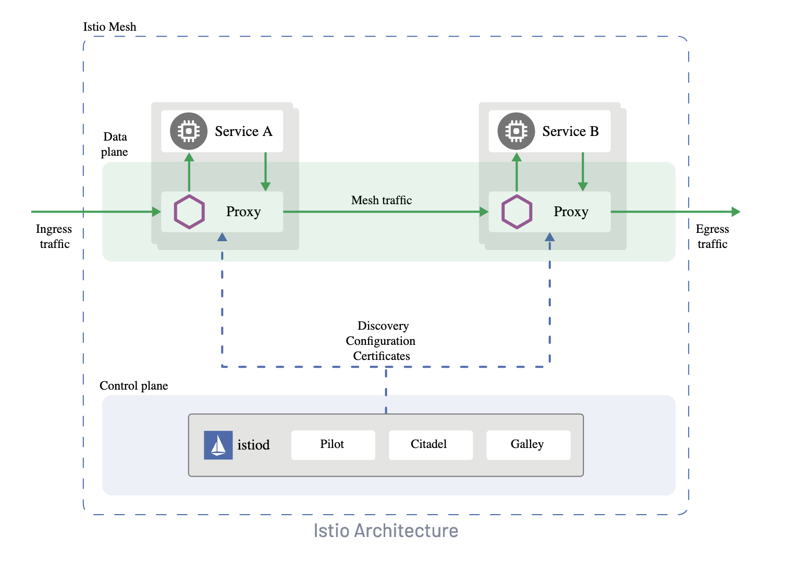
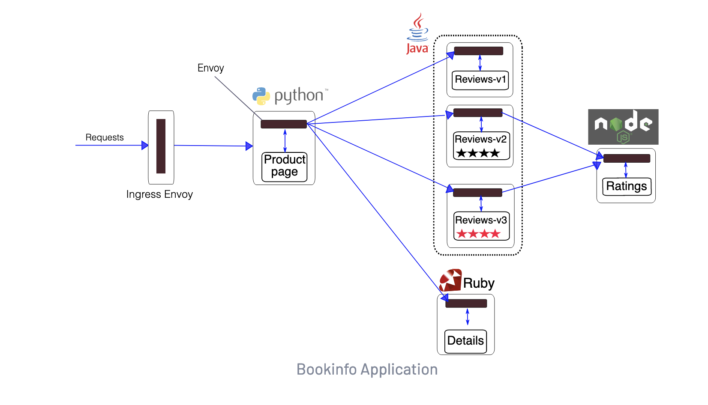
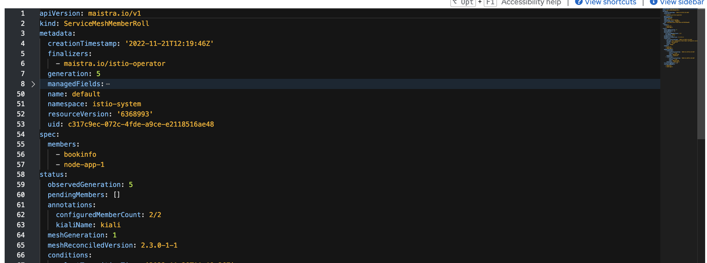
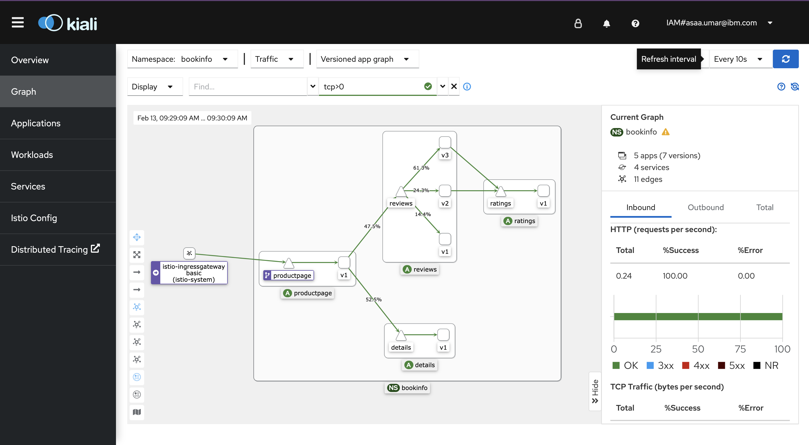
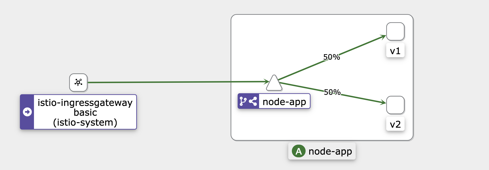

# Service Mesh Upskilling

## Introduction and Background

The purpose of this asset is to help in upskilling members of the client engineering team (and beyond) in Istio service mesh.

[Istio](https://istio.io/latest/about/service-mesh/) is an open source service mesh which adds a dedicated infrastructure layer to your microservices collections. A service mesh allows for the addition of capabilities such as observability, traffic management (e.g. for canary deployments and A/B testing), and security without making changes to application code. OpenShift Service Mesh(OSSM) is the RedHat OpenShift implementation of the Istio project, documentation for OSSM can be found [here](https://docs.openshift.com/container-platform/4.6/service_mesh/v2x/ossm-architecture.html)

This README is being written as we upskill in preparation for a project around service mesh and following the steps should allow you to deploy and use service mesh with some example applications and get comfortable with some of the CRDs.

## Prerequisites

- OCP cluster provisioned and accessible

## Contents

- [Service Mesh Upskilling](#service-mesh-upskilling)
  - [Introduction and Background](#introduction-and-background)
  - [Prerequisites](#prerequisites)
  - [Contents](#contents)
  - [Install Operators](#install-operators)
  - [Control Plane](#control-plane)
  - [Service Mesh Member Roll (SMMR)](#service-mesh-member-roll-smmr)
  - [Components](#components)
    - [Virtual Services](#virtual-services)
    - [Gateways](#gateways)
  - [Bookinfo](#bookinfo)
  - [Kiali](#kiali)
  - [Deploying and Configuring your own Apps](#deploying-and-configuring-your-own-apps)
    - [Steps for deploying the applications](#steps-for-deploying-the-applications)
    - [Steps for configuring service mesh resources](#steps-for-configuring-service-mesh-resources)

## Install Operators

OpenShift Service Mesh requires 4 operators:

- OpenShift Elasticsearch
- Red Hat OpenShift distributed tracing platform
- Kiali
- Red Hat OpenShift Service Mesh

These operators should be installed in this order

Steps (repeated for each operator)

1. Using the web console in the go to `Operator Hub` and search for the operator name
2. Select the Red Hat version of the Operator
3. Click `Install`
4. For `Red Hat OpenShift distributed tracing platform`, `Kiali` and `Red Hat OpenShift Service Mesh` the defaults can be accepted

- For the OpenShift Elasticsearch Operator, in the Update Channel section, select stable-5.x

5. Verify install by going to `Installed Operators`

## Control Plane

A service mesh is logically split into a data plane and a control plane

- The dataplane is made up of sidecar proxies which propogate and manage communications between microservices as well as provide metrics on traffic.
- The control plane manages and configures these sidecar proxies to route the traffic



To create the control plane:
From the web console create a new project called `istio-system`

In the `istio-system` project navigate to `Operators > Installed Operators > Red Hat OpenShift Service Mesh Operator > Istio Service Mesh Control Plane`

Click `Create ServiceMeshControlPlane`

- Settings such as mTLS can be configured later for now the default is acceptable

Click `Create`

Verify the Control Plane install by opening the instance of the control plane from the control plane tab (`Operators > Installed Operators > Red Hat OpenShift Service Mesh Operator > Istio Service Mesh Control Plane`) and checking its resources

## Service Mesh Member Roll (SMMR)

Openshift service mesh works on a per namespace basis (one control/data plane per cluster but you can have many independant meshes on the cluster under seperate namespaces).

To add a service mesh to a namespace the namespace must be added to the `ServiceMeshMemberRoll`

Steps to creating the member roll:

1. Go to `Operators > Installed Operators` and ensure the `istio-system` (May be called something different depending on what you named it when deploying the control plane) project is selected

- A member roll must be in the same namespace as the control plane
- Note: you cannot add the namespace holding the control plane to the member roll

2. Navigate to `RedHat OpenShift Service Mesh Operator > Istio Service Mesh Member roll tab` and click `Create ServiceMeshMemberRoll`
3. Click members (either through the form view or under the spec in yaml view) and observe the members section
4. Remove existing examples from the member section and ensure it is empty

- You can add many projects to a member roll but a project can only belong to one member roll

5. Click `Create`

## Components

### Virtual Services

A Virtual Service is a layer of abstraction which allows you to define and apply traffic routing rules when a host is addressed Each routing rule defines matching criteria for traffic. If the traffic is matched, then it is sent to a named destination service defined in the registry.

You can see the Virtual Service used for the bookinfo application under [bookinfo/istio.yaml](./bookinfo/istio.yaml). This virtual service does not make use of explicit traffic routing and therefore traffic is load balanced across the 3 versions you can see.

More information on routing rules with a Virtual Service and the options available can be found [here](https://istio.io/latest/docs/reference/config/networking/virtual-service/)

### Gateways

The Istio gateway object (an example can also be found in [bookinfo/istio.yaml](./bookinfo/istio.yaml)) allows Istio features such as monitoring and route rules to be applied to traffic entering the cluster.

You can configure both ingress and egress gateways however we will only be covering ingress gateways in this tutorial.

## Bookinfo

We are now ready to deploy our first application into a Service Mesh. The OpenShift documentation provides an example "bookinfo" application to run within a service mesh and see its capabilities. Steps for deploying and removing this app can be found [here](https://docs.openshift.com/container-platform/4.8/service_mesh/v2x/ossm-create-mesh.html#ossm-create-mesh)

For easier use of this asset the CRDs can be found in this git repo [here](./bookinfo/)

The book info architecture looks like this:



Things to note about the diagram are that we have various different microservices, using different languages, communicating with eachother and that each of these microservices has a sidecar proxy (brown bar labelled envoy) allowing it to communicate through the mesh.

It is also worth noting that there are 3 versions of the reviews microservice and this is where we will be controlling the traffic routing with istio.

To deploy the bookinfo application:

1. Create a namespace for the application called `bookinfo`
2. Add the namespace to the member roll by going to `Operators > Installed Operators > Red Hat OpenShift Service Mesh Operator > ServiceMeshMemberRoll` in the `istio-system` namespace, clicking on yaml view and adding book info to the spec



3. Log into OpenShift using cli and switch to correct namespace

```
oc login --server=[openshift-server-url] --token=[your-token]

oc project bookinfo
```

4. Deploy the book info resources by runnin: `oc create -f bookinfo/bookinfo.yaml -n bookinfo`

- Note: The bookinfo deployments already have the sidecar proxies configure, we will cover setting these up later

5. Verify the deployment by checking that all pods are up and running

The book info app has now been deployed into a service mesh and has the necessary means for microservices to communicate with one another, however there is no way of accessing this mesh or controlling the traffic. This is done using an ingress gateway and virtual service, which we will cover in more detail later.

To deploy the ingress gateway and virtual service for the bookinfo app:

> The gateway and VS are deployed in the target namespace not in the control plane namespace

Run the following:

```
oc create -f bookinfo/istio.yaml -n bookinfo
```

The above steps should have created a Virtual Service and an Ingress Gateway for you bookinfo mesh. Istio automatically generates a Route for entering the mesh when an ingress gateway is created and this can be found in the `istio-system` namespace under routes. To view the bookinfo app find the book info Route and append the endpoint `/productpage` to the url (ensure your browser has not set the url to https). Hit refresh a few times and you should see different versions of the application (reviews microservice) showing up with the same Route.

## Kiali

One of the operators we installed at the start was the Kiali operator; Kiali acts as the console for Istio Service Mesh and is one of the most useful tools when it comes to working with it. Kiali has a range of uses such as a visual topology graph, tracing and health checks.

The Route for Kiali should be automatically created when the Istio control plane is created and can be found under `istio-system(or the namespace you chose to house your control plane) > Networking > Routes > Kiali`

The screenshot below shows the graph for the bookinfo namespace in kiali with request distribution turned on. Take some time to explore Kiali and the different tabs and tools.



More info can be found on kiali [here](https://kiali.io)

## (Optional) Deploying and Configuring Apps (example)

Now we will be deploying 2 of your 'own' applications into a service mesh and seeing how to we can configure the applications to work with Istio.

There are 2 'versions' of a simple node up under [service-mesh-node-app-1](./service-mesh-node-app-1) and [service-mesh-node-app-2](./service-mesh-node-app-2). Have a look at these (one of them says hello world and the other goodbye world). We will be deploying these apps into the same namespace which we will then apply a service mesh to.

Each one of them has a Dockerfile:

- [Node App 1 Dockerfile](./service-mesh-node-app-1/Dockerfile)
- [Node App 2 Dockerfile](./service-mesh-node-app-2/Dockerfile)

### Steps for deploying the applications

#### Pre-requisites

Determine which image registry you are going to use for this section. You will need to be able to push and pull images from it. We are going to use the internal OpenShift registry for this example.

1. Log in to to the OpenShift cluster if needed

```
oc login --server=[openshift-server-url] --token=[your-token]
```

2. Expose OpenShift image registry if it is not exposed:

- Check if it is already exposed

```
oc get route default-route -n openshift-image-registry --template='{{ .spec.host }}'

// if error or empty response came back the registry is not exposed
```

- Expose the registry - skip this if already exposed

```
oc patch configs.imageregistry.operator.openshift.io/cluster --patch '{"spec":{"defaultRoute":true}}' --type=merge
```

- Extract the registry's address

```
REGISTRY=$(oc get route default-route -n openshift-image-registry --template='{{ .spec.host }}')
```

3. Log into the registry using podman

```
podman login -u kubeadmin -p $(oc whoami -t) --tls-verify=false $REGISTRY
```

#### Build and push the application images

1. Create namespace for your applications

```
// use any name you want for the project

oc new-project apps-example
```

1. Build the image for `service mesh node app 1`

```
podman build -t $REGISTRY/apps-example/service-mesh-node-app-1:latest -f service-mesh-node-app-1/Dockerfile service-mesh-node-app-1

```

2. Do the same for `service mesh node app 2`

```
podman build -t $REGISTRY/apps-example/service-mesh-node-app-2:latest -f service-mesh-node-app-2/Dockerfile service-mesh-node-app-2
```

3. Push these images to an image registry

```
podman push --tls-verify=false $REGISTRY/apps-example/service-mesh-node-app-1:latest

podman push --tls-verify=false $REGISTRY/apps-example/service-mesh-node-app-2:latest
```

4. Deploy Node apps - we will add them to the mesh later

Read through [yaml file](./istio-crds-single-service/example-apps.yaml)

- Creates 2 Deployments, 1 per node app version
- Creates 1 Service
- NOTE: The labelling for the deployments and service; this is how istio and kiali will organise your applications and their versions
- NOTE: The commented sidecar annotation, this is how you configure your application to have the sidecar proxies which istio uses to communicate and form the data plane.

Create the resources:

```
oc apply -f ./istio-crds-single-service/example-apps.yaml
```

5. Verify the resources were created correctly and that you have running pods for both versions of the app

Next we will be adding the namespace these apps are deployed in to the service mesh member roll and adding a virtual service and gateway to be able to access them.

### Steps for configuring service mesh resources

1. The first step is to go to `Operators > Installed Operators > Red Hat OpenShift Service Mesh Operator > Istio Service Mesh Member Roll` and adding the namespace to the members section.
2. We can now configure the application pods to each have their own sidecar proxy. To do so, uncomment the annotation and re apply the deployment files (alternatively you could add the annotation in the right place on the OCP console).
   - To ensure resources are restarted we can first delete them
   ```
   oc delete -f ./istio-crds-single-service/example-apps.yaml
   ```
   - Create resources again
   ```
   oc apply -f ./istio-crds-single-service/example-apps.yaml
   ```
   - NOTE: You should now see `2/2` instead of `1/1` for the application pods. this additional container is the proxy and you can verify this by clicking on the pod name and verifying the `istio-proxy` container is present.
3. Now that we have added the namespace to a mesh and configured the sidepods for intramesh communication, we can begin adding the istio CRDS. Review the yaml files [istio-crds-single-service](./istio-crds-single-service).
   - NOTE: The `weight: 50` entry on the virtual service, which refers to the percentage weighting of the traffic to that version
   - NOTE: The weights must add up to 100 or service mesh will throw an error.
4. Apply the Istio CRDS

```
oc apply -f ./istio-crds-single-service/gateway.yaml -n apps-example

oc apply -f ./istio-crds-single-service/virtual-service.yaml -n apps-example

oc apply -f ./istio-crds-single-service/destination-rules.yaml -n apps-example
```

Read more about Gateway [link]()

Read more about Virtual Service [link](https://istio.io/latest/docs/reference/config/networking/virtual-service/)

Read more about Destination Rule [link](https://istio.io/latest/docs/reference/config/networking/destination-rule/)

4. Now that the CRDS have been applied and the resources created we should be able to access the applications through the route which would have been created by the gateway.

- you can find the Route in the `istio-system` namespace, in our case it was `http://apps-example-node-app-gateway-<cluster-host>.com/`

5. Verify that you can see different messages and that traffic is split 50/50

- messages should be `Hello World` and `Goodbye World`

6. You can also now see the application namespace in Kiali as a graph and use all the other Kiali features.



## Conclusion

In this workshop you have learned about the basics of Istio and how it works. You have also seen an example application deployed onto OpenShift.
